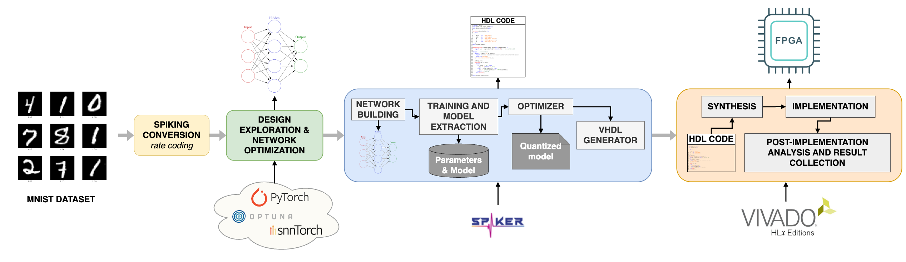

# MNIST Challenge ICIP 2025

This project addresses the **[Digit Recognition Low Power and Speed Challenge](https://mlunglma.github.io/challenge.html#overview)** at **ICIP 2025**, aiming at developing an FPGA-based accelerator capable of performing efficient and accurate handwritten digit recognition. Specifically, our solution leverages **[Spiker+](https://github.com/smilies-polito/Spiker)**, an open-source framework designed for the rapid development, optimization, and deployment of **Spiking Neural Networks** (**SNNs**) on **FPGA** platforms. The main objective is optimizing classification accuracy, inference speed, and energy efficiency by exploring design trade-offs between SNN complexity and FPGA resource constraints.

**"SFATTI: Spiking FPGA Accelerator for Temporal Task-driven Inference -- A Case Study on MNIST"**  
*Alessio Caviglia, Filippo Marostica, Alessio Carpegna, Alessandro Savino, Stefano Di Carlo*  
Presented at **[IEEE ICIP 2025](https://2025.ieeeicip.org)**

## 📁 Repository Structure

```bash
├── challenge_environment.yml   # Conda environment file for reproducibility
├── exploration_scripts/        # Folder with scripts for SNN exploration
├── images/                     # Diagrams and figures for README files
├── mnist.ipynb                 # Main Jupyter Notebook for training, quantization & HDL generation
├── output/                     # Generated HDL files (.vhd) and memory coefficients (.coe)
├── README.md                   # Project documentation
├── Trained/                    # Folder for storing trained model
```

## Project Workflow Overview

The workflow involves four main phases:

1. **[Software Exploration](#software-exploration)**: Define the initial SNN model and train using surrogate gradient methods in PyTorch (via **[SnnTorch](https://github.com/jeshraghian/snntorch)** and **[Optuna](https://github.com/optuna/optuna)**). Rapidly evaluate various architectures and neuron models for accuracy and computational efficiency.

2. **[Quantization & HDL Generation (Spiker+)](#quantization--hdl-generation-spiker)**: Perform quantization exploration and optimization using **Spiker+**, identifying optimal numerical precision (bit-widths) for neurons and synaptic weights.
Automatically generate synthesizable VHDL code from the optimized model.

3. **[Hardware Deployment (Vivado)](#hardware-deployment-vivado)**: Integrate the generated VHDL architecture directly into a Vivado project. Configure the FPGA constraints using a dedicated `.xdc` file. Target FPGA platform: `Xilinx Kintex XC7K160TFBG484-1`.

4. **Evaluation**: Verify performance metrics: inference accuracy, latency, throughput, and resource utilization using Vivado synthesis reports.



## 🔍 Software Exploration

Prior to hardware generation, hyperparameter exploration was performed using **Optuna**, integrated with the **Spiker+** software stack. The foundation of our model development is **PyTorch**, which provides the core tensor operations and training infrastructure. On top of this, we used **SnnTorch**, a PyTorch-based library specifically designed for training **Spiking Neural Networks** (**SNNs**) using surrogate gradient methods. SnnTorch seamlessly supports neuron dynamics, spike generation, and BPTT-compatible training workflows.

Optuna systematically searched the hyperparameter space, evaluating diverse configurations (layer size, neuron type, training specific parameters) to determine optimal trade-offs. This exploration phase is purely software-driven, with the goal of maximizing model accuracy before any hardware constraints are considered. The selection criterion for promoting a configuration to the hardware design phase was strictly set to models achieving a test accuracy ≥ 97.5%.

## 🔧 Quantization & HDL Generation (Spiker+)

The quantization phase refines the trained SNN model for efficient hardware deployment. Using **Spiker+**, we systematically explore numerical precision (bit-width) for neurons and weights balancing resource usage and classification accuracy.

👉 Detailed Steps: For a complete step-by-step explanation of the quantization process and HDL generation flow, please refer to the [Quantization & HDL Generation Notebook](./mnist.ipynb).

## ⚙️ Hardware Deployment (Vivado)

The final optimized **Hardware Description Language** (**HDL**) is automatically generated by the Spiker+ framework. The resulting **VHDL** code is stored within the project’s output directory, as defined by the script parameter `output_dir = "output"`.

This folder contains the full SNN accelerator architecture, including:

 * **Neuron models** (Leaky Integrate-and-Fire, optimized for FPGA efficiency).
 * **Network parameters** stored in `.coe` files for ROM memory initialization.

### Vivado Project Integration

To deploy the architecture on FPGA hardware:

1. **Vivado Project Setup**: Create a new Vivado project.
2. **Select FPGA board**: Xilinx Kintex `XC7K160TFBG484-1` from the Vivado *Parts* list.
3. **Constraints (XDC File)**: The provided `.xdc` constraints file defines physical pin mappings and clock frequency. It ensures correct timing and hardware integration.
4. **Memory Initialization (.coe Files)**: Generated by Spiker+ to initialize internal memory, these .coe files must be loaded into Vivado's Block RAM memory IPs. The user must istantiate the memory using the **BRAM** block from the IP Library and then load each ROM with the given `.coe` files.
5. **Synthesis and Implementation**: Finally run Vivado synthesis and implementation processes to generate the final FPGA bitstream and evaluate the results in terms of Power Consumption, Resource utilization and Maximum Clock Frequency. Along with the implementation results running the Functional simulation it is possibile to evaluate the latency of the accelerator.

## 🧪 Test the workflow

To test and reproduce the full workflow, begin by setting up the environment:

1. **Initialize the Conda Environment**: Use the provided `.yml` file to create a reproducible software environment:

```bash
conda env create -f challenge_environment.yml
conda activate challenge_environment
```

2. **Run the Software Pipeline**: You can execute the Optuna-based exploration script to test how different network configurations affect accuracy, latency, and resource utilization. Most importantly, run the main pipeline script `python mnist.py`.
This script loads or trains the SNN model, it applies quantization (if enabled), it generates the VHDL files and finally saves trained weights and hardware description into the specified output directory.

3. **Open Vivado for Hardware Deployment**: Launch Vivado and create a new project. Select the target FPGA part: XC7K160TFBG484-1, add the generated VHDL files from the `output/` folder as project sources, add the provided `.xdc` constraints file to map I/O signals and use the generated `.coe` initialization files to instantiate and initialize ROM memories (typically using the Block Memory Generator IP).

4. **Synthesize and Implement the Design**: Run synthesis and implementation in Vivado to generate the final bitstream. This step finalizes the design and allows you to program the FPGA for live testing.

## 📌 Citation

**[SFATTI: Spiking FPGA Accelerator for Temporal Task-driven Inference -- A Case Study on MNIST](https://arxiv.org/abs/2507.10561)**

```
@misc{caviglia2025sfattispikingfpgaaccelerator,
      title={SFATTI: Spiking FPGA Accelerator for Temporal Task-driven Inference -- A Case Study on MNIST}, 
      author={Alessio Caviglia and Filippo Marostica and Alessio Carpegna and Alessandro Savino and Stefano Di Carlo},
      year={2025},
      eprint={2507.10561},
      archivePrefix={arXiv},
      primaryClass={cs.NE},
      url={https://arxiv.org/abs/2507.10561}, 
}
```
